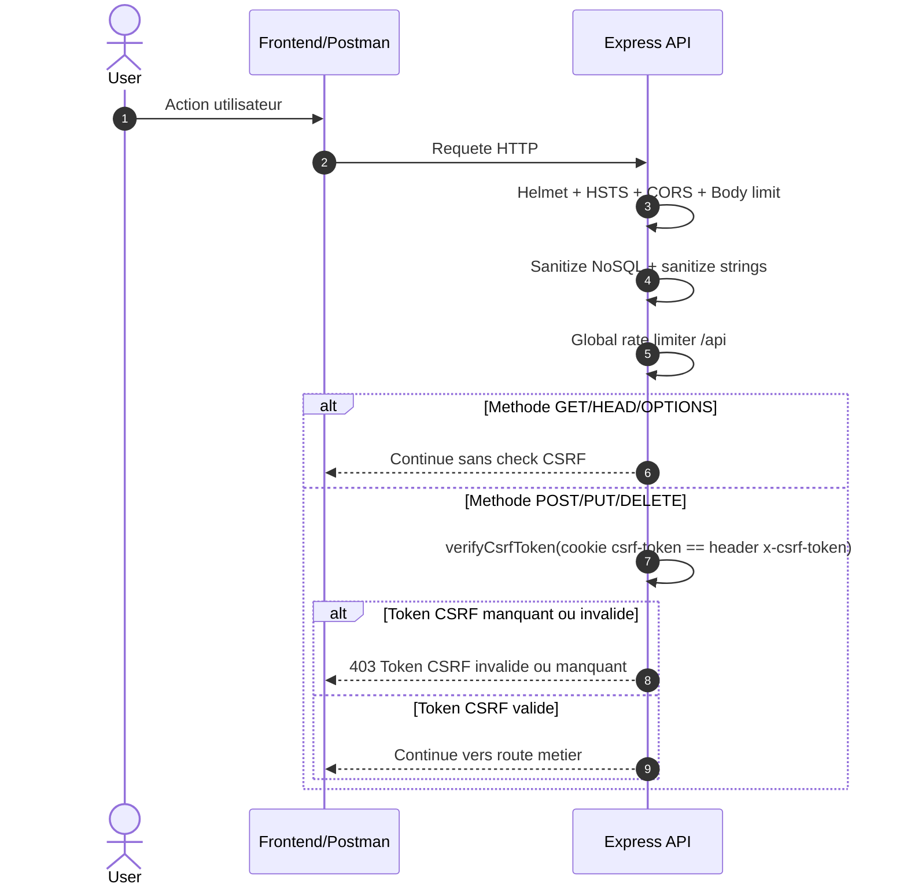
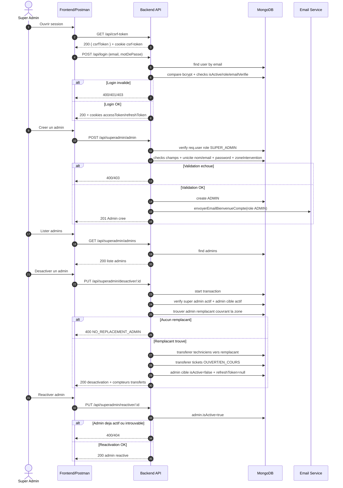
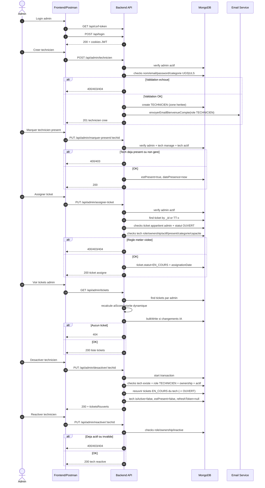
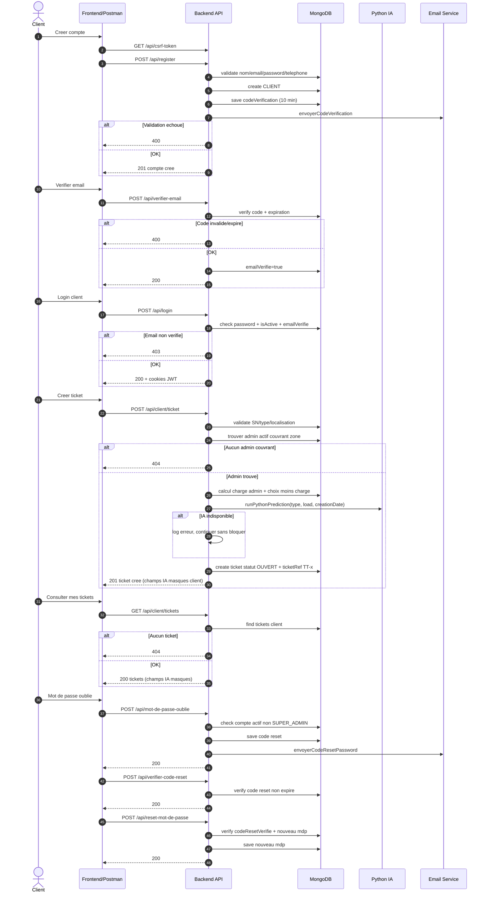
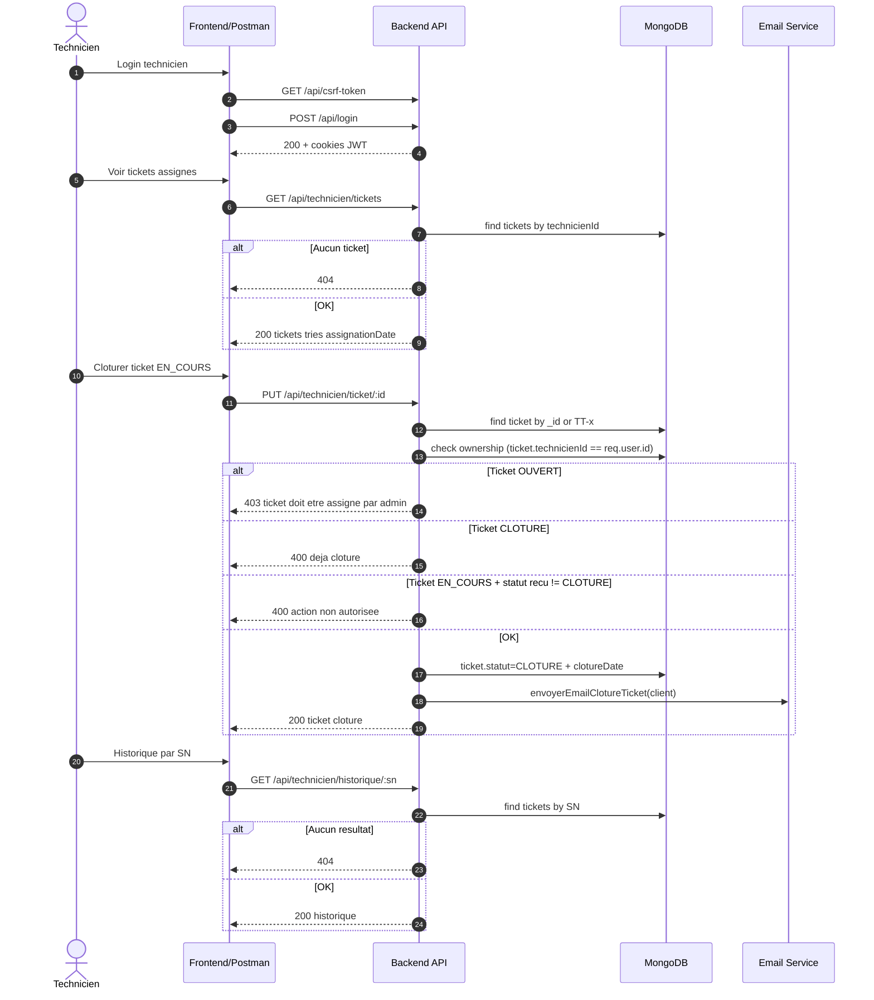

# Diagrammes de sequence complets

Ce document decrit les flux backend acteur par acteur selon le code actuel.

## Legende

- Toutes les routes /api en POST/PUT/DELETE exigent x-csrf-token.
- Les routes protegees exigent le cookie accessToken (JWT).
- Les codes d'erreur les plus frequents sont notes dans les branches alt.

## Pipeline de securite (toutes requetes /api)

## Acteur 1: Super Admin

## Acteur 2: Admin

## Acteur 3: Client

## Acteur 4: Technicien

## Notes d'execution

- Le refresh token est limite au path /api/refresh-token.
- Le backend masque les champs IA pour CLIENT et TECHNICIEN.
- La desactivation admin et technicien utilise des transactions MongoDB.
